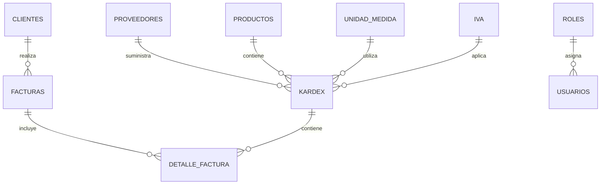

<div align="center">

# Sistema de Facturación y Gestión de Tienda

[](https://angular.io/)
[](https://php.net/)
[](https://sqlite.org/)
[](https://getbootstrap.com/)
[](LICENSE)

**Sistema completo de gestión empresarial con arquitectura MVC y frontend moderno en Angular**

[Demo](/) | [Documentación](#documentación) | [Reportar Bug](/) | [Solicitar Feature](/)

</div>

---

## Tabla de Contenidos

- [Características](#características)
- [Arquitectura](#arquitectura)
- [Tecnologías](#tecnologías)
- [Requisitos Previos](#requisitos-previos)
- [Instalación Rápida](#instalación-rápida)
- [Estructura de Base de Datos](#estructura-de-base-de-datos)
- [Módulos del Sistema](#módulos-del-sistema)
- [Documentación](#documentación)
- [Contribución](#contribución)
- [Licencia](#licencia)

---

## Características

### Frontend Moderno

- Angular 18 con componentes standalone
- Bootstrap 5 responsive design
- ApexCharts para visualización de datos
- Soporte para tema oscuro/claro
- 100% Mobile responsive

### Backend Robusto

- Arquitectura MVC en PHP
- Sistema de autenticación seguro
- API RESTful completa
- SQLite para persistencia de datos (sin configuración de servidor)
- Generación de reportes PDF (FPDF)

### Funcionalidades Principales

| Módulo | Descripción | Estado |
|--------|-------------|--------|
| **Productos** | Gestión completa del catálogo de productos | Completado |
| **Clientes** | Administración de cartera de clientes | Completado |
| **Proveedores** | Control de proveedores y contactos | Completado |
| **Inventario (Kardex)** | Sistema de entradas/salidas con trazabilidad | Completado |
| **Facturación** | Emisión y gestión de facturas | Completado |
| **Unidades de Medida** | Conversión y gestión de medidas | Completado |
| **IVA** | Configuración de impuestos | Completado |
| **Usuarios** | Control de acceso y permisos | Completado |
| **Reportes** | Generación de informes PDF | Completado |

---

## Arquitectura

```
Proyectos/
├── 01tarea/                       # Módulo de práctica inicial
├── 02getpost/                     # Ejemplos GET/POST con MVC básico
│   ├── config/                    # Configuración de conexión
│   ├── controllers/               # Controladores
│   ├── models/                    # Modelos de datos
│   ├── public/                    # Recursos públicos
│   └── views/                     # Vistas HTML + JS
│
├── 03MVC/                         # Backend Principal (PHP MVC)
│   ├── config/                    # Configuración del sistema
│   ├── controllers/               # Controladores de la aplicación
│   │   ├── clientes.controller.php
│   │   ├── factura.controller.php
│   │   ├── productos.controller.php
│   │   ├── proveedores.controller.php
│   │   └── ...
│   ├── models/                    # Modelos de datos
│   │   ├── clientes.model.php
│   │   ├── factura.model.php
│   │   ├── productos.model.php
│   │   └── ...
│   ├── reports/                   # Generación de reportes PDF
│   │   └── fpdf/                  # Librería FPDF
│   ├── database/                  # Base de datos SQLite
│   │   └── facturacion.db         # Archivo de base de datos
│   ├── public/                    # Recursos públicos
│   └── tienda/                    # Frontend Angular (Tienda)
│
├── 04Plantilla/                   # Dashboard Admin Angular
│   ├── src/
│   │   ├── app/
│   │   │   ├── clientes/          # Módulo de clientes
│   │   │   ├── facturas/          # Módulo de facturas
│   │   │   ├── productos/         # Módulo de productos
│   │   │   ├── proveedores/       # Módulo de proveedores
│   │   │   ├── Services/          # Servicios HTTP
│   │   │   ├── Interfaces/        # TypeScript interfaces
│   │   │   └── Guards/            # Auth guards
│   │   └── assets/                # Recursos estáticos
│   └── scss/                      # Estilos SASS personalizados
│
└── BaseFacturacion.mwb            # Modelo de base de datos
```

---

## Tecnologías

<div align="center">

### Frontend


### Backend


### Herramientas


</div>

---

## Requisitos Previos

Antes de comenzar, asegúrate de tener instalado:

| Requisito | Versión Mínima | Descarga |
|-----------|----------------|----------|
| Node.js | v18.0+ | [nodejs.org](https://nodejs.org/) |
| pnpm | v8.0+ | `npm install -g pnpm` |
| PHP | v8.0+ | [php.net](https://php.net/) |

> **Nota:** SQLite viene incluido con PHP, no requiere instalación adicional.

---

## Instalación Rápida

### 1. Clonar el Repositorio

```bash
git clone https://github.com/tu-usuario/sistema-facturacion.git
cd sistema-facturacion
```

### 2. Inicializar la Base de Datos

La base de datos SQLite se crea automáticamente. Para inicializarla manualmente:

```bash
cd 03MVC/database
php init_db.php
```

### 3. Instalar Dependencias del Frontend

```bash
# Dashboard Admin (04Plantilla)
cd 04Plantilla
pnpm install

# Tienda Angular (03MVC/tienda)
cd ../03MVC/tienda
pnpm install
```

### 4. Iniciar el Servidor PHP

```bash
cd 03MVC
php -S localhost:8000
```

### 5. Ejecutar la Aplicación Angular

```bash
cd 04Plantilla
pnpm start
```

Abre tu navegador en `http://localhost:4200`

---

## Estructura de Base de Datos



### Tablas Principales

| Tabla | Descripción |
|-------|-------------|
| `Proveedores` | Información de empresas proveedoras |
| `Productos` | Catálogo de productos con código de barras |
| `Kardex` | Movimientos de inventario (entradas/salidas) |
| `Clientes` | Base de datos de clientes |
| `Factura` | Registro de ventas |
| `Detalle_Factura` | Items de cada factura |
| `Unidad_Medida` | Unidades y factores de conversión |
| `IVA` | Configuración de tasas impositivas |
| `Usuarios` | Control de acceso al sistema |
| `Roles` | Permisos y roles de usuario |

---

## Módulos del Sistema

### Gestión de Productos

- CRUD completo de productos
- Código de barras
- Configuración de IVA por producto
- Búsqueda y filtrado avanzado
- Exportación a PDF

### Control de Inventario (Kardex)

- Registro de entradas (compras)
- Registro de salidas (ventas)
- Cálculo automático de stock
- Múltiples unidades de medida
- Historial de movimientos

### Facturación

- Generación de facturas
- Cálculo automático de IVA
- Impresión y exportación PDF
- Historial de ventas
- Reportes por período

### Gestión de Clientes y Proveedores

- Registro completo de clientes
- Base de datos de proveedores
- Información de contacto
- Historial de transacciones

---

## Documentación

### API Endpoints

```
GET    /controllers/productos.controller.php?op=todos
POST   /controllers/productos.controller.php?op=insertar
PUT    /controllers/productos.controller.php?op=editar
DELETE /controllers/productos.controller.php?op=eliminar
```

### Servicios Angular

```typescript
@Injectable({ providedIn: 'root' })
export class ProductosService {
  private apiUrl = 'http://localhost:8000/controllers/';
  
  getProductos(): Observable<Producto[]> {
    return this.http.get<Producto[]>(`${this.apiUrl}productos.controller.php?op=todos`);
  }
}
```

---

## Contribución

Las contribuciones son bienvenidas.

1. Fork el proyecto
2. Crea tu rama (`git checkout -b feature/AmazingFeature`)
3. Commit tus cambios (`git commit -m 'Add: nueva característica'`)
4. Push a la rama (`git push origin feature/AmazingFeature`)
5. Abre un Pull Request

---

## Autor: Francisco Quinteros (Quinan_Dev)

| Información |
|-------------|
| Proyecto Académico |
| 2023 - 2026 (Mejoras) |

---

## Licencia

Este proyecto está bajo la Licencia MIT. Consulta el archivo [LICENSE](LICENSE) para más detalles.

---

<div align="center">

**[Volver arriba](#sistema-de-facturación-y-gestión-de-tienda)**

</div>
